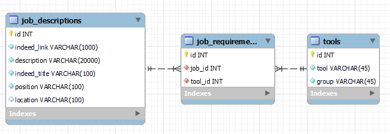

# DataSkills

The main goal of this project was too find out what are the most requested skills for a data scientist and data analyst to have in Brazil.

This project secondary goal is to serve as a project portfolio. Below I have the steps done in this project and tools used:

1. Creation of database and tables on MySQL to store the job descriptions and tools requested in the descriptions. I also manually inserted into a table the tools to be searched inside the descriptions (sql scripts and diagram files in the MySQL DB folder). 

2. Gathering of job descriptions data from the brasilian (indeed)[br.indeed.com] website using Python Selenium and sqlalchemy to store the data into MySQL (code in get_data.py). 
3. Description text cleaning and extraction of tools from the job description by using keywords, if the tool name I added in the DB is inside the description, then I save this information in the DB (code in notebook extract_tools.ipynb)
4. Analysing the data using pandas, seaborn, matplotlib and mlxtend (code in notebook analysis.ipynb)
  4.1 Word Cloud: What are the most common words used in the job descriptions?
  4.2 Top 10 locations with more job opportunities in Brazil
  4.3 Association Rules: What are the tools that are usually requested together in the job descriptions?
  4.4 Top 20 tools requested by tool type (Language, Library, etc...) and job position (data analyst and data scientist)
